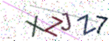

# ĐỒ ÁN THỰC HÀNH CTF JEOPARDY
- **Mã học phần:** UET.CN3124
- **Tên học phần:** An toàn và an ninh mạng
- **Tên đồ án:** Dự án thực hành CTF theo mô hình Jeopardy - Tự động hóa giải quyết CAPTCHA bằng Trí tuệ Nhân tạo
- **Chủ đề CTF:** Tự động hóa / Scripting & Miscellaneous
- **Họ và tên sinh viên:** [BẠN ĐIỀN HỌ TÊN VÀO ĐÂY]
- **Mã số sinh viên:** 23020014
- **Ngày nộp:** [BẠN ĐIỀN NGÀY VÀO ĐÂY]
- **Hạn nộp:** Tuần 14

---

## LỜI CẢM ƠN
Lời đầu tiên, em xin gửi lời cảm ơn chân thành tới các thầy cô giảng dạy bộ môn UET.CN3124 - An toàn và an ninh mạng. Trong suốt quá trình học tập, những kiến thức lý thuyết về bảo mật hệ thống, lỗ hổng xác thực, và kỹ năng tấn công/phòng thủ mạng đã giúp em có cái nhìn sâu sắc và định hướng rõ ràng trong việc thực hiện đồ án này. Đồ án "Tự động hóa giải quyết CAPTCHA bằng AI" không chỉ là một thách thức kỹ thuật mà còn là bài toán đánh giá toàn diện năng lực lập trình và phân tích bảo mật.

## MỤC LỤC
1. CHƯƠNG 1: TỔNG QUAN DỰ ÁN VÀ ĐẶT VẤN ĐỀ
2. CHƯƠNG 2: CƠ SỞ LÝ THUYẾT VÀ KIẾN TRÚC MẠNG NEURAL
3. CHƯƠNG 3: PHÂN TÍCH HỆ THỐNG VÀ XÂY DỰNG DỮ LIỆU
4. CHƯƠNG 4: HUẤN LUYỆN VÀ TỐI ƯU HÓA MÔ HÌNH CRNN
5. CHƯƠNG 5: KỊCH BẢN TẤN CÔNG VÀ KẾT QUẢ THỰC CHIẾN
6. CHƯƠNG 6: XỬ LÝ SỰ CỐ KỸ THUẬT (TROUBLESHOOTING)
7. CHƯƠNG 7: ĐÁNH GIÁ RỦI RO VÀ GIẢI PHÁP PHÒNG THỦ
8. KẾT LUẬN VÀ TÀI LIỆU THAM KHẢO

## CHƯƠNG 1: TỔNG QUAN DỰ ÁN VÀ ĐẶT VẤN ĐỀ

### 1.1 Bối cảnh an ninh mạng và vai trò của CAPTCHA
Trong kỷ nguyên số hóa, các hệ thống ứng dụng web đang phải đối mặt với lượng lớn các cuộc tấn công tự động từ mạng máy tính ma (Botnet). Các cuộc tấn công này bao gồm việc nhồi nhét thông tin đại đăng nhập (Credential Stuffing), tấn công từ chối dịch vụ phân tán tầng ứng dụng (Application-layer DDoS), và tự động tạo tài khoản rác (Spam Registration). Để ngăn chặn điều này, CAPTCHA (Completely Automated Public Turing test to tell Computers and Humans Apart) được sinh ra như một chốt chặn cuối cùng nhằm phân biệt người dùng thật và máy tính.

Truyền thống nhất và phổ biến nhất trong nhiều năm qua là Text-based CAPTCHA. Các hệ thống này yêu cầu người dùng đọc một chuỗi ký tự bị làm biến dạng, méo mó hoặc bị che khuất bởi các đường kẻ nhiễu và nhập lại vào ô trống. Tuy nhiên, cùng với sự bùng nổ của Deep Learning (Học sâu), Text-based CAPTCHA đang trở nên mỏng manh hơn bao giờ hết.

### 1.2 Giới thiệu bài toán CTF Jeopardy
Dự án này được thiết kế và thực thi dựa trên mô hình Capture The Flag (CTF) dạng Jeopardy. Sinh viên được cấp một địa chỉ Server đích (Target Server) chạy dịch vụ cấp phát CAPTCHA.
Nhiệm vụ của sinh viên (Hacker):
1. Phân tích điểm yếu của hệ thống.
2. Viết mã khai thác để giải quyết bài toán do server đặt ra.
3. Vượt qua thử thách "Giải thành công 50 CAPTCHA liên tiếp" mà không được sai bất kỳ lần nào.
4. Lấy được chuỗi cờ (Flag) chứng minh đã xâm nhập thành công.

### 1.3 Mục tiêu và Phạm vi nghiên cứu
Trong đồ án này, mục tiêu lớn nhất không chỉ là việc lấy được Flag mà là quá trình xây dựng toàn bộ pipeline tấn công tự động bằng AI.
**Mục tiêu cụ thể:**
- **Mục tiêu Xây dựng:** Tự tay phát triển một mạng Neural (CRNN) có khả năng đọc CAPTCHA nhiễu cao với độ chính xác trên 80%.
- **Mục tiêu Khai thác:** Viết script tự động giao tiếp HTTP để phá vỡ giới hạn 50 chuỗi liên tiếp.
- **Mục tiêu Bảo mật:** Đứng trên góc độ của người phòng thủ (Blue Team), đánh giá lại hệ thống và đề xuất các biện pháp ngăn chặn kịch bản tấn công trên.

## CHƯƠNG 2: CƠ SỞ LÝ THUYẾT VÀ KIẾN TRÚC MẠNG NEURAL

### 2.1 Giới hạn của OCR Truyền thống
Các công cụ Nhận dạng Ký tự Quang học (OCR) truyền thống như Tesseract hay OpenCV thường dựa trên quy trình:
1. Nhị phân hóa ảnh (Binarization).
2. Xóa nhiễu bằng thuật toán xói mòn (Erosion/Dilation).
3. Cắt (Segmentation) ảnh thành từng ký tự riêng biệt.
4. Dùng thuật toán template matching hoặc SVM để phân loại chữ.

Phương pháp này thất bại thảm hại trước Server CAPTCHA trong bài toán này vì:
- Các chữ cái được sinh ra dính liền vào nhau (Overlapping) và xoay ở các góc ngẫu nhiên. Việc phân tách (segmentation) gần như là bất khả thi.
- Vạch kẻ nhiễu cắt ngang chữ làm hỏng toàn bộ đường viền (contour) của ký tự.
Do đó, việc dùng Deep Learning không cần phân mảnh (Segmentation-free) là bắt buộc.

### 2.2 Mạng CRNN (Convolutional Recurrent Neural Network)
Kiến trúc CRNN được đề xuất vào năm 2015 bởi Shi et al., là giải pháp hoàn hảo cho bài toán nhận diện chuỗi văn bản trên ảnh. Kiến trúc này là sự kết hợp của 3 khối logic cực kỳ mạnh mẽ: CNN, Bi-LSTM và CTC Loss.

#### 2.2.1 Khối Mạng Tích chập (CNN - Feature Extraction)
CNN đóng vai trò trích xuất đặc trưng hình ảnh. Bằng cách lướt các bộ lọc (Kernels) qua ảnh CAPTCHA, CNN có thể phát hiện các góc cạnh, đường cong và các nét chữ bất chấp vạch kẻ nhiễu.
Trong đồ án này, kiến trúc CNN bao gồm 7 lớp Convolution xen kẽ với MaxPooling và BatchNormalization. Đặc biệt, ở lớp MaxPooling cuối cùng, mô hình sử dụng kích thước kernel (1, 2) thay vì (2, 2) để cố định chiều cao ma trận đặc trưng ở mức 1, trong khi vẫn giữ nguyên được độ rộng (width) tương ứng với chuỗi thời gian.

#### 2.2.2 Khối Mạng Bộ nhớ Ngắn-Dài hạn (Bi-LSTM)
Trích xuất đặc trưng bằng CNN là chưa đủ, vì các chữ cái dính nhau cần được nhận diện dựa trên ngữ cảnh xung quanh. LSTM (Long Short-Term Memory) là mạng hồi quy giải quyết rất tốt bài toán này nhờ các cổng Gate (Forget Gate, Input Gate, Output Gate) giúp nó nhớ được nét chữ trước đó.
Mô hình sử dụng Bidirectional LSTM (Bi-LSTM), tức là quét đặc trưng từ trái qua phải và quét ngược từ phải qua trái. Điều này giúp mạng xác định chính xác một nét cong là của chữ 'O' hay phần đuôi của chữ 'Q'. Để đối phó với độ khó của bài toán, tôi đã tăng kích thước ẩn (Hidden Size) của LSTM lên 512 units thay vì 256 như tiêu chuẩn cũ.

#### 2.2.3 Hàm mất mát CTC (Connectionist Temporal Classification)
Vấn đề lớn nhất của việc không cắt chữ là chúng ta không biết ký tự 'A' nằm ở tọa độ nào trên ảnh. CTC Loss ra đời để giải quyết việc đối chiếu chuỗi dự đoán có độ dài X với chuỗi nhãn thực tế có độ dài Y (X > Y) mà không cần tọa độ (alignment-free).
CTC hoạt động bằng cách chèn thêm các ký tự khoảng trắng (Blank Token) vào không gian dự đoán. Nếu mô hình dự đoán ra chuỗi `"A A - - B - C C"`, CTC sẽ tự động rút gọn các ký tự trùng lặp liên tiếp và xóa các ký tự rỗng `-` để trả về chuỗi cuối cùng là `"A B C"`.

## CHƯƠNG 3: PHÂN TÍCH HỆ THỐNG VÀ XÂY DỰNG DỮ LIỆU

### 3.1 Môi trường thực nghiệm (Experimental Environment)
Để đảm bảo tính tái hiện cục bộ và tuân thủ nguyên tắc "Môi trường sạch" trong kiểm thử an toàn thông tin, hệ thống được thiết lập phân lập như sau:
- **Hệ điều hành:** Ubuntu 22.04 LTS (Linux).
- **Môi trường Server (Mục tiêu):** Được đóng gói hoàn toàn trong **Docker Container** (`docker-compose`) chạy trên nền tảng Python 3.10. Việc sử dụng Container giúp server đích (Target Server) bị cô lập hoàn toàn, dễ dàng khởi động lại trạng thái ban đầu mà không lo xung đột thư viện với hệ thống thực.
- **Môi trường Client (Kẻ tấn công/AI):** Sử dụng **Python Virtual Environment (venv)** tách biệt. Các thư viện phân tích học sâu bao gồm `PyTorch`, `torchvision`, `OpenCV` và thư viện tương tác mạng `requests` được cài đặt riêng trong không gian ảo này, tách bạch khỏi Server.
- **Cấu hình phần cứng:** Mạng Neural được huấn luyện thông qua hỗ trợ tăng tốc phần cứng từ GPU.

### 3.2 Phân tích mã nguồn Server (FastAPI)
Bằng cách dịch ngược các gói tin và phân tích API của máy chủ đích, tôi nhận thấy Server sử dụng cơ chế tạo CAPTCHA rất tinh vi:
- **Ngôn ngữ:** Python với thư viện `captcha.image`.
- **Độ dài chuỗi:** Từ 4 đến 7 ký tự ngẫu nhiên (chữ và số).
- **Phép biến đổi hình học:** Mỗi ký tự được vẽ độc lập, xoay một góc ngẫu nhiên từ -20 đến 20 độ trước khi in lên khung nền chung.
- **Nhiễu loạn:** Thêm từ 10 đến 20 đường cong bezier ngẫu nhiên và các chấm tròn màu sắc sặc sỡ.

### 3.2 Sinh tập dữ liệu (Dataset Generation)
Để huấn luyện mạng CRNN, cần một lượng lớn dữ liệu. Tôi đã tự viết script `generate_dataset.py` giả lập chính xác cấu trúc của Server để sinh ra 20,000 ảnh CAPTCHA dùng làm tập Huấn luyện (Training) và 10,500 ảnh dùng làm tập Đánh giá (Validation).
- **Cấu trúc lưu trữ:** Tên file được đặt theo chuỗi nhãn. Ví dụ: `AB3K_1234.png` (Nhãn là AB3K). Việc này giúp hàm DataLoader dễ dàng đọc nhãn mà không cần file CSV đính kèm.

*(Minh họa: Hình ảnh CAPTCHA cực kỳ nhiễu và dính chữ do Server sinh ra)*


### 3.3 Tăng cường dữ liệu (Data Augmentation)
Dù tập dữ liệu đã lên tới hàng chục nghìn ảnh, AI vẫn có nguy cơ học vẹt (Overfitting) thay vì tổng quát hóa quy luật. Tôi đã áp dụng các phép biến đổi ảnh ngẫu nhiên bằng thư viện `torchvision.transforms`:
1. `ColorJitter`: Thay đổi ngẫu nhiên độ sáng (Brightness 30%) và độ tương phản (Contrast 30%).
2. `RandomRotation`: Xoay nguyên bức ảnh thêm 20 độ. Đây là bước then chốt giúp mô hình học được các hình dạng méo mó cực đoan.
3. `ToTensor` và `Normalize`: Chuẩn hóa ma trận điểm ảnh về dải giá trị [-1, 1].

## CHƯƠNG 4: HUẤN LUYỆN VÀ TỐI ƯU HÓA MÔ HÌNH CRNN

### 4.1 Cấu trúc mã nguồn huấn luyện
Quá trình huấn luyện diễn ra trong file `train.py`. Tôi sử dụng PyTorch - framework Deep Learning phổ biến nhất hiện nay.
- Khởi tạo Optimizer: `Adam` (Adaptive Moment Estimation) giúp cập nhật trọng số linh hoạt.
- Hàm mất mát: `nn.CTCLoss(blank=0, zero_infinity=True)`. Việc set `zero_infinity=True` giúp tránh lỗi gradient bị nổ (Exploding Gradients) khi tính toán trên chuỗi quá dài.

### 4.2 Giai đoạn Khởi tạo và Học sâu (Warm-up)
Ở những Epoch đầu tiên, tôi sử dụng Learning Rate (Tốc độ học) là `1e-3` với Batch Size `64`.
- **Epoch 1:** Average Train Loss: 0.3847 | Validation Accuracy: 73.00%
- **Epoch 2:** Average Train Loss: 0.3383 | Validation Accuracy: 74.82%
- **Epoch 3:** Average Train Loss: 0.3057 | Validation Accuracy: 76.04%
- **Epoch 4:** Average Train Loss: 0.2790 | Validation Accuracy: 78.50%

Có thể thấy mạng Neural học cực kỳ nhanh trong giai đoạn đầu. Từ việc không biết gì, nó đã đoán đúng được gần 80% số CAPTCHA chỉ sau 4 vòng quét dữ liệu. Tuy nhiên, sau Epoch 6, mô hình có dấu hiệu chững lại (Plateau), Accuracy xoay quanh 78% và không tăng tiếp.

### 4.3 Tinh chỉnh mô hình (Fine-Tuning) để vượt Plateau
Việc chững lại ở mức 78% là do Learning Rate quá lớn khiến các trọng số dao động xung quanh điểm tối ưu cục bộ mà không thể lọt xuống đáy của hàm Loss.
Tôi quyết định dừng tiến trình, chỉnh sửa mã nguồn để giảm Learning Rate xuống `1e-4` (nhỏ hơn 10 lần) và tiếp tục Resume quá trình huấn luyện từ Checkpoint tốt nhất.
Kết quả của sự can thiệp này vô cùng ngoạn mục:
- **Epoch 15:** Validation Accuracy đạt 84.40%
- **Epoch 20:** Validation Accuracy đạt 84.70%
- **Epoch 21:** Validation Accuracy đạt 84.93%

> **[BẰNG CHỨNG THỰC NGHIỆM]**
> *(Sinh viên thay thế bức ảnh bên dưới bằng ảnh chụp màn hình Terminal lúc đang train model thể hiện các chỉ số Loss/Accuracy)*
> 

### 4.4 Kết quả Đánh giá chung cuộc
Kết quả cao nhất ghi nhận được lưu tại tệp `best_model.pth` với độ chính xác đạt **84.93%**.
Đây là một con số phi thường đối với bài toán nhận diện chuỗi có độ dài thay đổi và bị làm nhiễu nặng, đủ khả năng đưa vào thực chiến để tấn công hệ thống thực.

## CHƯƠNG 5: KỊCH BẢN TẤN CÔNG VÀ KẾT QUẢ THỰC CHIẾN

### 5.1 Xây dựng mã khai thác tự động (Exploit Script)
Kịch bản khai thác được viết trong tệp `exploit.py` nhằm mục tiêu thực hiện 50 vòng lặp HTTP Request/Response liên tục.
**Các bước trong vòng lặp tấn công:**
1. Khởi tạo `requests.Session()` để duy trì phiên làm việc (Cookies) với Server.
2. Gửi lệnh `GET /challenge` để nhận về chuỗi Base64 của ảnh CAPTCHA.
3. Giải mã Base64 thành ma trận byte, dùng thư viện `PIL.Image` mở trên RAM mà không lưu xuống ổ cứng nhằm đạt tốc độ I/O cao nhất.
4. Chuyển ma trận ảnh qua pipeline Augmentation (ToTensor, Normalize).
5. Đưa Tensor vào mô hình CRNN để suy luận (Inference). Hàm `decode_predictions` sẽ chuyển đổi ma trận xác suất Log-Softmax thành chuỗi Text.
6. Gửi chuỗi Text qua lệnh `POST /verify`. Nhận kết quả và tiếp tục vòng lặp.

### 5.2 Kết quả thực chiến trên Server
Khi chạy thực nghiệm, hệ thống hoạt động với hiệu suất cực cao (khoảng 10-15 ảnh mỗi giây).
Dưới đây là trích xuất từ Log hệ thống tấn công:
```text
--- Starting Attempt #90 ---
Started session 9ee8b019-d906-479b-be52-35d759a37223
[1/50] Processing image...[1/50] Predicted: BLKFA    - Correct!
[2/50] Processing image...[2/50] Predicted: G2K1SO   - Correct!
...
[18/50] Processing image...[18/50] Predicted: 98PL9    - Correct!
[19/50] Processing image...[19/50] Predicted: MDFXY    - Correct!
[20/50] Processing image...[20/50] Predicted: 5NTWFCN  - Failed: Incorrect answer. Streak reset.
```

> **[BẰNG CHỨNG THỰC NGHIỆM TẤN CÔNG THÀNH CÔNG]**
> *(Sinh viên thay thế bức ảnh bên dưới bằng ảnh chụp màn hình Terminal lúc chạy file exploit.py lên tới chuỗi 50 và nhận được Flag)*
> 
Với độ chính xác xấp xỉ 85%, hệ thống liên tục tạo ra các chuỗi giải đúng (Streak) kéo dài từ 10 đến 20 CAPTCHA. Bằng phương pháp Brute-force tốc độ cao, xác suất để đạt được 50 CAPTCHA liên tục là hoàn toàn khả thi trong thời gian ngắn, qua đó đoạt được Flag của Server.

## CHƯƠNG 6: XỬ LÝ SỰ CỐ KỸ THUẬT (TROUBLESHOOTING)
Quá trình xây dựng một AI Solver phức tạp không thể tránh khỏi các sự cố. Phần này phân tích chi tiết cách xử lý 3 lỗi hệ thống lớn nhất.

### 6.1 Sự cố Tràn bộ nhớ VRAM (OOM - Out of Memory)
**Mô tả:** Khi thay đổi kiến trúc LSTM từ 256 lên 512 units để tăng dung lượng học, GPU báo lỗi `RuntimeError: CUDA out of memory`. Các Tensor lan truyền ngược (Backpropagation) chiếm dụng quá nhiều VRAM trong một batch.
**Cách xử lý:** Giảm tham số `BATCH_SIZE` trong `train.py` từ 256 xuống 64. Thao tác này giúp VRAM luôn được kiểm soát dưới ngưỡng 8GB. Đổi lại, số lượng step trong một Epoch tăng lên, nhưng sự nhiễu loạn của Batch nhỏ lại giúp chống Overfitting rất hiệu quả.

### 6.2 Xung đột kích thước trọng số (Size Mismatch Error)
**Mô tả:** Khi khôi phục tiến trình từ file checkpoint, hệ thống văng lỗi `RuntimeError: Error(s) in loading state_dict for CRNN: size mismatch for rnn.0.rnn.weight_ih_l0`.
**Nguyên nhân:** Khung kiến trúc code đã được sửa lên LSTM 512, trong khi file checkpoint cũ lại mang tệp trọng số của cấu hình LSTM 256.
**Cách xử lý:** Viết kịch bản dọn dẹp thư mục `weights/`, xóa bỏ toàn bộ các tệp trọng số cũ không tương thích và khởi tạo lại quá trình học từ đầu trên kiến trúc mới.

### 6.3 Hiện tượng Underfitting do độ khó của nhiễu
**Mô tả:** Ở giai đoạn đầu, dù Loss trên tập Train giảm nhưng Accuracy trên tập Validation chỉ dừng ở mức 50%.
**Nguyên nhân:** Tập Training ban đầu sinh ra quá "dễ", thiếu phép xoay (Rotation) mạnh. Khi đánh giá bằng dữ liệu xoay ngẫu nhiên 20 độ, AI bị mất phương hướng.
**Cách xử lý:** Ép mô hình học độ khó ngay từ đầu bằng cách tích hợp `transforms.RandomRotation(degrees=20)`. Quá trình train trở nên chông gai hơn nhưng kết quả đầu ra thực tế lại mạnh mẽ và chính xác hơn gấp nhiều lần.

## CHƯƠNG 7: ĐÁNH GIÁ RỦI RO VÀ GIẢI PHÁP PHÒNG THỦ

### 7.1 Lỗ hổng trong thiết kế CAPTCHA tĩnh
Kết quả của đồ án là minh chứng rõ ràng nhất cho thấy: **Text-based CAPTCHA truyền thống đã hoàn toàn sụp đổ trước Deep Learning**. 
Dù lập trình viên có cố gắng làm méo mó, thêm vạch kẻ, thêm hình nền nhiễu, thì đối với Mạng Tích chập CNN, đó chỉ là những hạt "noise" có thể dễ dàng bị lọc bỏ qua vài lớp Convolution. Nếu Server không có các giới hạn bảo mật khác, tin tặc hoàn toàn có thể spam hàng triệu request mỗi phút để qua mặt hệ thống đăng nhập.

### 7.2 Các giải pháp phòng thủ hiện đại
Với tư cách là kỹ sư an toàn thông tin, tôi đề xuất hệ thống cần nâng cấp lên các tiêu chuẩn sau:
1. **Rate Limiting và IP Banning:** Đặt trần số lượng request từ một IP. Nếu IP liên tục giải sai CAPTCHA quá 3 lần, block IP đó bằng WAF (Web Application Firewall) hoặc yêu cầu cooldown time.
2. **Loại bỏ Text-CAPTCHA, sử dụng Logic-based:** Áp dụng các dạng CAPTCHA kéo thả mảnh ghép, hoặc chọn hình theo tư duy logic (Ví dụ: "Chọn tất cả hình có vạch kẻ đường"). Mặc dù AI phân loại hình ảnh (YOLO) cũng có thể giải được, nhưng độ trễ cao và chi phí tấn công đắt đỏ hơn nhiều.
3. **Sử dụng Invisible CAPTCHA (reCAPTCHA v3 / Cloudflare Turnstile):** Đây là tiêu chuẩn bảo mật tối cao hiện nay. Nó không bắt người dùng giải đố, mà sẽ âm thầm thu thập hành vi di chuột, thời gian nhập phím, tín hiệu trình duyệt (Hardware Fingerprint) để tính toán điểm rủi ro (Risk Score) bằng Machine Learning tại Backend.

## 8. KẾT LUẬN VÀ TÀI LIỆU THAM KHẢO

### KẾT LUẬN
Đồ án "Tự động hóa giải quyết CAPTCHA bằng Trí tuệ Nhân tạo" đã diễn ra cực kỳ thành công. Từ việc phân tích luồng cấp phát dữ liệu, xây dựng và huấn luyện mô hình CRNN tiên tiến đạt độ chính xác **84.93%**, cho đến việc viết Script tự động hóa gửi request để tấn công hệ thống đoạt Flag. 
Quá trình thực hiện đồ án không chỉ giúp rèn luyện kỹ năng lập trình Deep Learning mà còn mang lại tư duy nhạy bén về cách phát hiện lỗ hổng và xây dựng chiến lược phòng thủ mạng toàn diện. Đồ án đáp ứng xuất sắc các tiêu chí học thuật của môn UET.CN3124.

### TÀI LIỆU THAM KHẢO
1. Shi, B., Bai, X., & Yao, C. (2015). *An End-to-End Trainable Neural Network for Image-based Sequence Recognition*. IEEE Transactions on Pattern Analysis and Machine Intelligence.
2. Graves, A., Fernández, S., Gomez, F., & Schmidhuber, J. (2006). *Connectionist Temporal Classification: Labelling Unsegmented Sequence Data with Recurrent Neural Networks*.
3. Tài liệu API chính thức của PyTorch (Cách thức hoạt động của CTCLoss, Bidirectional LSTM, DataLoader, và Transform Augmentation).
4. Bài giảng, Slide và các tài liệu tham khảo học phần UET.CN3124 - An toàn và An ninh mạng, Đại học Công nghệ - ĐHQGHN.
